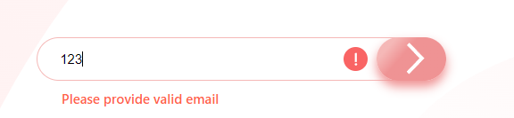

# Project 1: Project HTML and CSS

Two layouts of web applications called Apparel and Ecommerce. They were developed using HTML, CSS and JavaScript technologies.

These are group projects created on bootcamp [Infoshare Academy](https://github.com/infoshareacademy/). These projects are challenges from [Frontend Mentor](https://www.frontendmentor.io/challenges).

## Apparel

#

This is a coming soon page.

It consist of an email input. If you try to write something that isn't an email type, you will get the error massage below.

Below you can see mobile version with hamburger menu.

## Ecommerce

#

This is an ecommerce product page.

You can select amount of products to buy, change the main photo and display cart.

